# TestTask-1

Test task for VNV Solutions.

Simple two-page website for administering users and groups.

## Review

### Users

  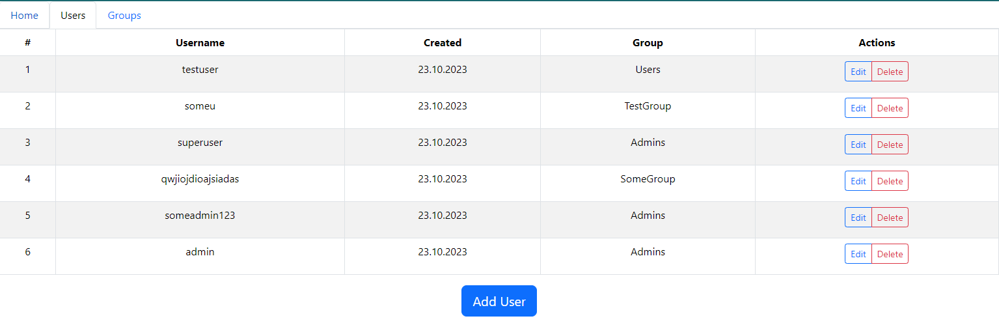

<i>User table.</i>

  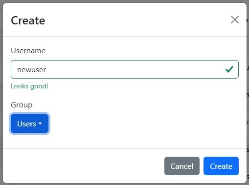

<i>User creation.</i>

  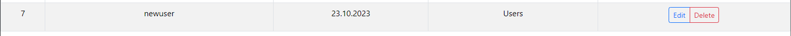

<i>Created user.</i>

  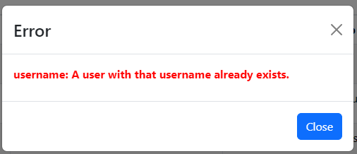

<i>An error occurred when trying to create user with the same name.</i>

  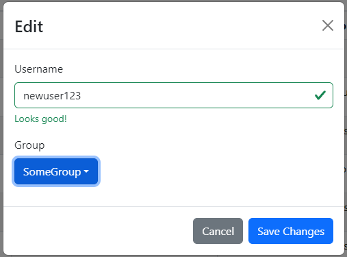

<i>User editing.</i>

  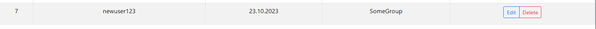

<i>Edited user.</i>

### Groups

    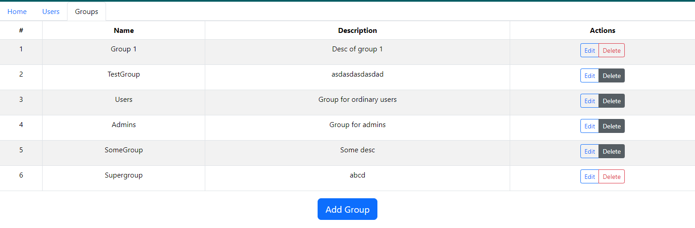

<i>Group table.</i>

  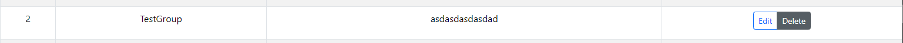

<i>It's impossible to delete group when it contains at least one user.</i>

  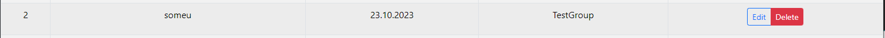

<i>Deleting user who is in the "TestGroup" group.</i>

  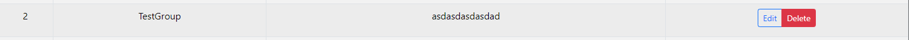

<i>Now zero users is in the "TestGroup" so we can delete it.</i>

  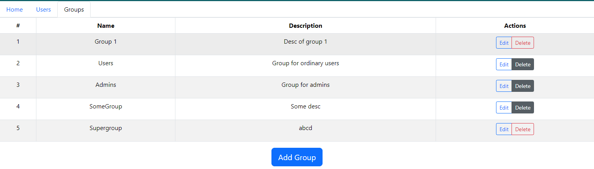

<i>Group table without "TestGroup".</i>

## Server

### Technologies

- Django
- Django REST framework
- Docker

To see more details: [server](server)

## Client

### Technologies

- React
- React Bootstrap
- MobX

To see more details: [client](client)

